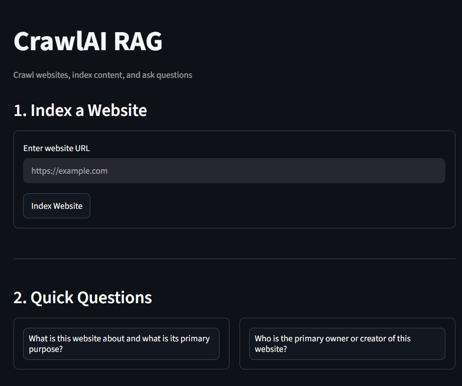
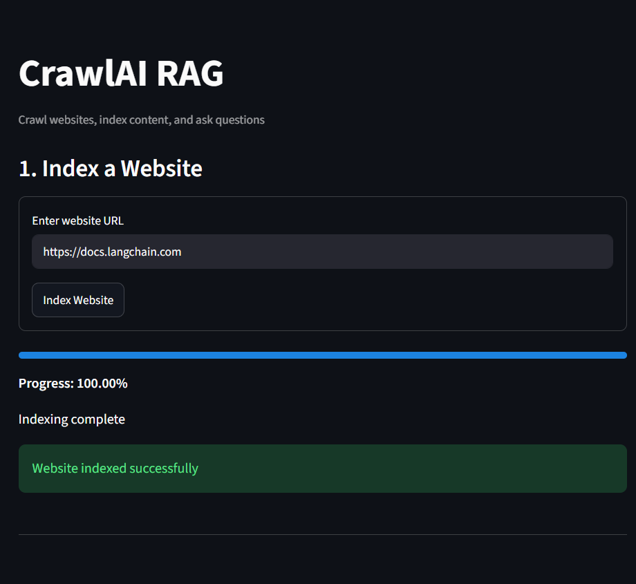
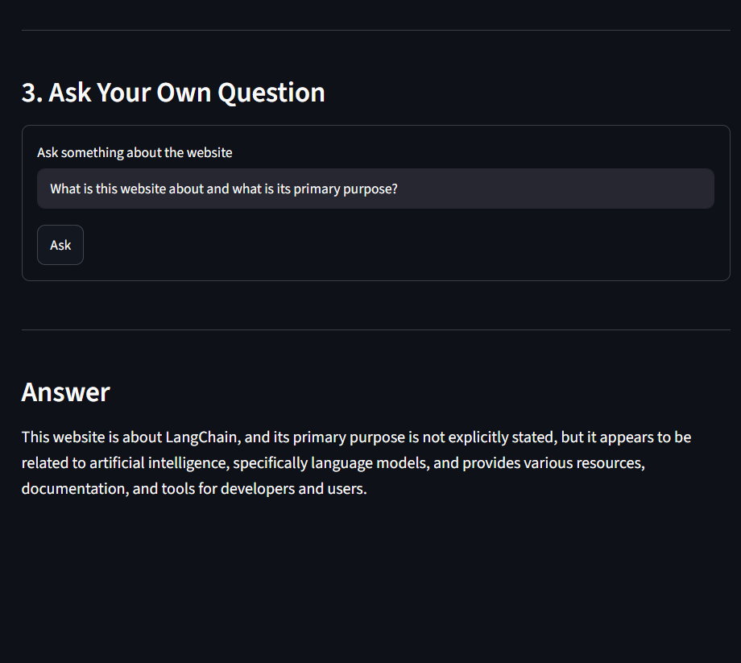

# WebsiteCrawlr

**AI-Powered Website Knowledge Assistant**

WebsiteCrawlr is a Retrieval-Augmented Generation (RAG) system that transforms any website into a searchable knowledge base.

The application crawls a website, extracts and indexes its content, stores semantic embeddings in a vector database, and enables users to ask natural language questions grounded in the website's content.

Built using FastAPI, Playwright, ChromaDB, LangChain, Sentence Transformers, Groq, and Streamlit.

---

## Overview

Large websites often contain valuable information spread across multiple pages, making it difficult to quickly find answers.

WebsiteCrawlr solves this problem by automatically:

1. Crawling website pages
2. Extracting visible content
3. Chunking and embedding text
4. Building a vector knowledge base
5. Retrieving relevant information
6. Generating grounded answers using an LLM

Instead of manually searching through documentation, blogs, knowledge bases, or company websites, users can simply ask questions in natural language.

---

## Architecture

```text
User URL
    │
    ▼
┌─────────────────────┐
│ Website Crawler     │
│ Playwright          │
└─────────┬───────────┘
          │
          ▼
┌─────────────────────┐
│ Content Extraction  │
│ Text + Internal URLs│
└─────────┬───────────┘
          │
          ▼
┌─────────────────────┐
│ Text Chunking       │
│ Fixed-size Chunks   │
└─────────┬───────────┘
          │
          ▼
┌─────────────────────┐
│ Embedding Model     │
│ all-MiniLM-L6-v2    │
└─────────┬───────────┘
          │
          ▼
┌─────────────────────┐
│ ChromaDB            │
│ Vector Store        │
└─────────┬───────────┘
          │
          ▼
     User Query
          │
          ▼
┌─────────────────────┐
│ Similarity Search   │
│ Top-K Retrieval     │
└─────────┬───────────┘
          │
          ▼
┌─────────────────────┐
│ Groq Llama 3.3 70B  │
│ Answer Generation   │
└─────────┬───────────┘
          │
          ▼
   Grounded Answer
```

---

## RAG Pipeline

The system follows a Retrieval-Augmented Generation workflow.

### 1. Crawl

The crawler visits the provided website and discovers internal links.

Responsibilities:

* Crawl website pages
* Follow internal links
* Avoid duplicate pages
* Extract visible content
* Handle lazy-loaded pages

### 2. Index

Extracted content is transformed into embeddings and stored in ChromaDB.

Responsibilities:

* Chunk website content
* Generate embeddings
* Store vectors
* Create website-specific collections

### 3. Retrieve

When a user submits a question:

* Semantic similarity search is performed
* Relevant chunks are retrieved
* Context is supplied to the LLM

### 4. Generate

The LLM generates an answer using only the retrieved website content.

The system prompt explicitly instructs the model to:

* Use only indexed website content
* Avoid adding external information
* Indicate when information is not found

---

## Features

* Website crawling using Playwright
* Internal link discovery
* Duplicate content detection
* Lazy-loading page support
* Semantic search using embeddings
* ChromaDB vector storage
* Retrieval-Augmented Generation (RAG)
* Grounded question answering
* FastAPI backend
* Streamlit frontend
* Groq-powered LLM inference
* Modular architecture

---

## Tech Stack

### AI & LLM

* LangChain
* Groq API
* Llama 3.3 70B Versatile

### Embeddings

* Sentence Transformers
* all-MiniLM-L6-v2

### Vector Database

* ChromaDB

### Web Crawling

* Playwright

### Backend

* FastAPI

### Frontend

* Streamlit

### Utilities

* Python
* python-dotenv

---

## Crawling Strategy

The crawler uses a breadth-first crawling approach.

Workflow:

```text
Seed URL
   │
   ▼
Visit Page
   │
   ▼
Extract Content
   │
   ▼
Discover Internal Links
   │
   ▼
Queue New URLs
   │
   ▼
Repeat
```

Key capabilities:

* Internal-domain crawling
* Duplicate page prevention
* Content hash comparison
* Progressive scrolling
* Dynamic content handling
* Page stabilization before extraction

---

## Project Structure

```text
WebsiteCrawlr/
│
├── app.py
├── main.py
├── requirements.txt
├── .env.example
│
├── scraper/
│   └── crawler.py
│
└── rag/
    ├── chunker.py
    ├── vectorstore.py
    └── qa.py
```

### File Responsibilities

| File               | Purpose                                      |
| ------------------ | -------------------------------------------- |
| app.py             | Streamlit frontend                           |
| main.py            | FastAPI backend and API endpoints            |
| scraper/crawler.py | Website crawling and content extraction      |
| rag/chunker.py     | Text chunking logic                          |
| rag/vectorstore.py | Embedding generation and ChromaDB management |
| rag/qa.py          | Retrieval and question-answering pipeline    |
| .env.example       | Environment variable template                |

---

## Screenshots

### Home Page

The landing page where users provide a website URL and initiate the indexing process.



### Website Indexing

The crawler extracts content from website pages, chunks the data, generates embeddings, and stores them in ChromaDB for retrieval.



### Question Answering

Users can ask natural language questions about the indexed website and receive answers grounded in the retrieved content.



---

---

## Installation

### Clone Repository

```bash
git clone https://github.com/AkashBharangar/WebsiteCrawlr.git

cd WebsiteCrawlr
```

### Create Virtual Environment

Windows

```bash
python -m venv venv

venv\Scripts\activate
```

Linux / Mac

```bash
python3 -m venv venv

source venv/bin/activate
```

### Install Dependencies

```bash
pip install -r requirements.txt
```

### Install Playwright Browsers

```bash
playwright install
```

---

## Environment Variables

Create a `.env` file in the project root.

```env
GROQ_API_KEY=your_groq_api_key
```

A sample template is provided in:

```text
.env.example
```

---

## Running the Application

### Start FastAPI Backend

```bash
uvicorn main:app --reload
```

Backend:

```text
http://localhost:8000
```

### Start Streamlit Frontend

```bash
streamlit run app.py
```

Frontend:

```text
http://localhost:8501
```

---

## Example Workflow

### Step 1

Provide a website URL.

```text
https://docs.langchain.com
```

### Step 2

The system crawls and indexes the website.

```text
Website
   ↓
Crawler
   ↓
Chunks
   ↓
Embeddings
   ↓
ChromaDB
```

### Step 3

Ask a question.

```text
How do LangChain tools work?
```

### Step 4

The system retrieves relevant content and generates an answer grounded in the indexed website.

---

## Engineering Highlights

This project demonstrates:

* Retrieval-Augmented Generation (RAG)
* Semantic Search
* Vector Databases
* Embedding Pipelines
* Web Crawling
* Knowledge Base Construction
* LLM Integration
* Prompt Engineering
* FastAPI Development
* End-to-End GenAI System Design

---

## Future Improvements

Potential enhancements include:

* Source citations in answers
* Hybrid search (keyword + vector)
* Reranking pipelines
* Incremental indexing
* Multi-website knowledge bases
* Asynchronous crawling
* Sitemap-based discovery
* User authentication
* Deployment-ready persistence layer

---

## Why This Project

Most LLM applications are simple chat interfaces built on top of an API.

WebsiteCrawlr focuses on a core AI Engineering problem: transforming unstructured web content into a searchable knowledge system.

The project combines crawling, retrieval, embeddings, vector databases, and LLM-powered question answering into a complete end-to-end RAG pipeline.

It demonstrates practical experience building systems that acquire knowledge, index information, retrieve relevant context, and generate grounded responses rather than relying solely on a model's pretrained knowledge.

---

## License

This project is licensed under the MIT License.
